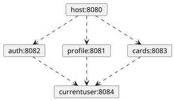

# Задание 1

## Функционал проекта **MESTO**
1. Загрузка фотографий
2. Удаление фотографий
3. Сбор и учёт лайков под фото
4. Создание профиля и его редактирования.

## Разбивка фронтенда на микрофронтенды
Для разбивки фронтенда на микрофронтенды выберем клиентскую компоновку и реализуем её с помощью **Webpack Module Federation**.
Взаимодействие между компонентами организуем через React context (микрофронтенд **currentuser**). В итоге у нас получится четыре микрофронтенда и основное (host) приложение:
- **host**. Основное приложение, отвечающее за загрузку необходимых микрофронтендов
- **auth**. Регистрация и аутентификация пользователей. Реализует функционал:
  - Регистрация нового пользователя
  - Аутентификация пользователя в приложении и выписка ему jwt токена
  - Выход авторизированного пользователя из системы
  
  Новый компонент **ProfileEmailAndExit** отвечает за отрисовку email'а пользователя и кнопки "выход". 
- **profile**. Просмотр и редактирование профиля пользователя
  - Просмотр информации о профиле (новый компонент **ProfileInfo**)
  - Редактирование профиля (изменение аватара пользователя и его имени)   
- **cards**. Просмотр и удаление существующих, добавление новых карточек.
  - Просмотр списка карточек
  - Давление новой карточки (за это отвечает новый компонент **AddPlace**)
  - Удаление карточки
  - Добавление/удаление своего "лайка" с карточки
  - Отображение общего количества лайков для карточки
   
  Теоретически можно разбить этот микрофронтенд на два: один бы отвечал за отображение списка карточек и, при необходимости, их пагинацию, а второй за отображение конкретной карточки и ее свойств. Но на первичном этапе это избыточно.  
- **currentuser**. Микрофронтенд, хранящий общее состояние для всех микросервисов, в нашем случае хранит текущего пользователя.

Ниже приведена диаграмма зависимостей для каждого микрофронтенда:



и структура каталогов:

```
microfrontend
├── auth
│   ├── components
│   │   ├── InfoTooltip.js
│   │   ├── Login.js
│   │   └── Register.js
│   ├── package.json
│   └── webpack.config.js
├── cards
│   ├── components
│   │   ├── AddPlace.js
│   │   ├── AddPlacePopup.js
│   │   ├── Card.js
│   │   ├── ImagePopup.js
│   │   ├── Main.js
│   │   └── PopupWithForm.js
│   ├── package.json
│   └── webpack.config.js
├── currentuser
│   ├── contexts
│   │   └── CurrentUserContext.js
│   ├── package.json
│   └── webpack.config.js
├── host
│   ├── components
│   │   ├── App.js
│   │   ├── Footer.js
│   │   ├── Header.js
│   │   └── ProtectedRoute.js
│   ├── package.json
│   ├── src
│   │   ├── App.jsx
│   │   ├── index.css
│   │   ├── index.html
│   │   └── index.js
│   └── webpack.config.js
└── profile
    ├── components
    │   ├── EditAvatarPopup.js
    │   ├── EditProfilePopup.js
    │   ├── PopupWithForm.js
    │   ├── ProfileEmailAndExit.js
    │   └── ProfileInfo.js
    ├── package.json
    └── webpack.config.js
```

# Задание 2

[Download](./sprint1.task2.drawio)